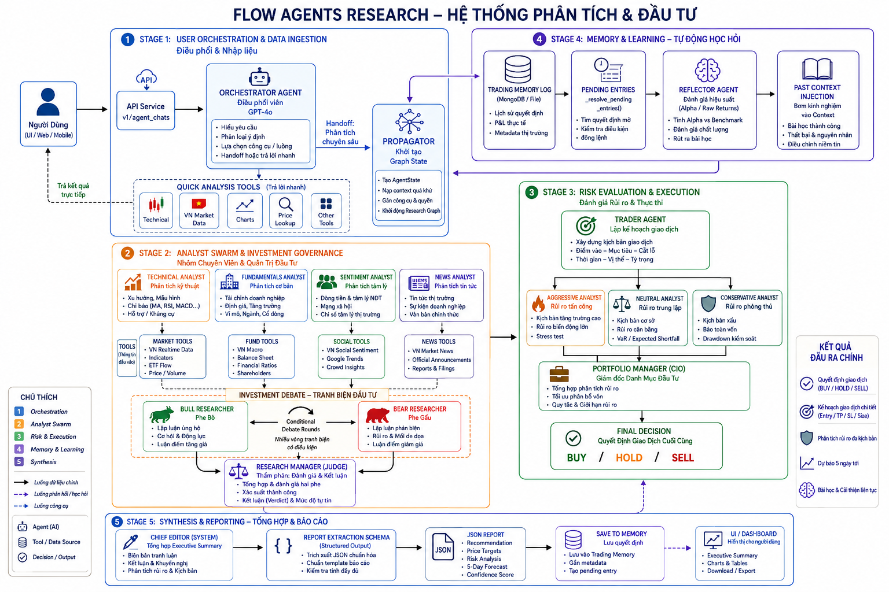
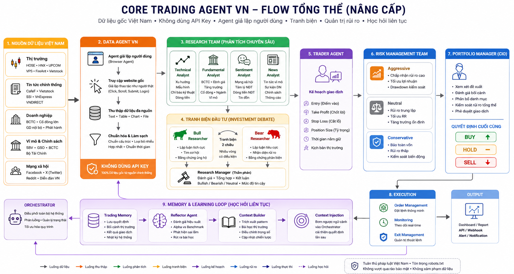
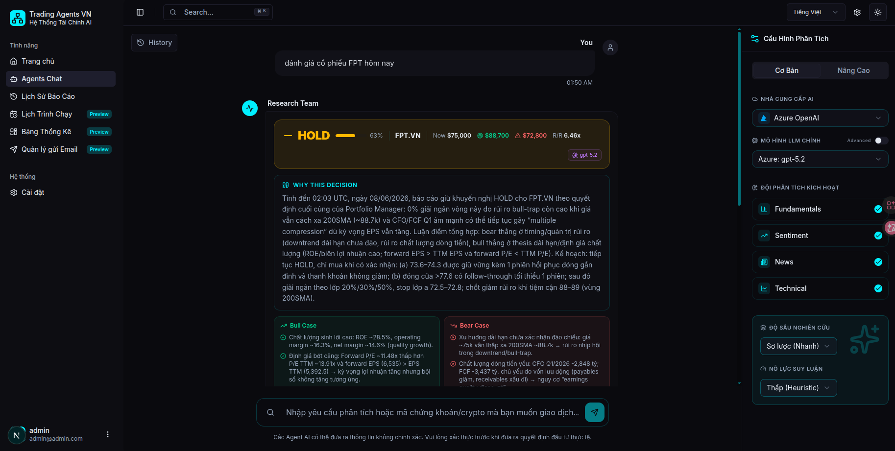
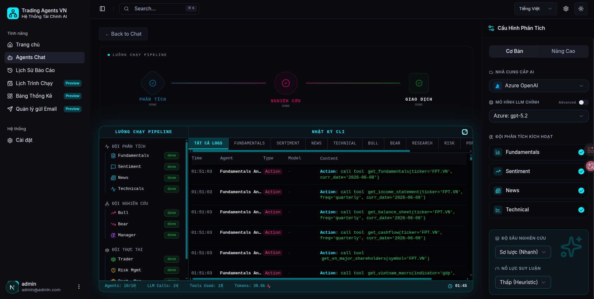
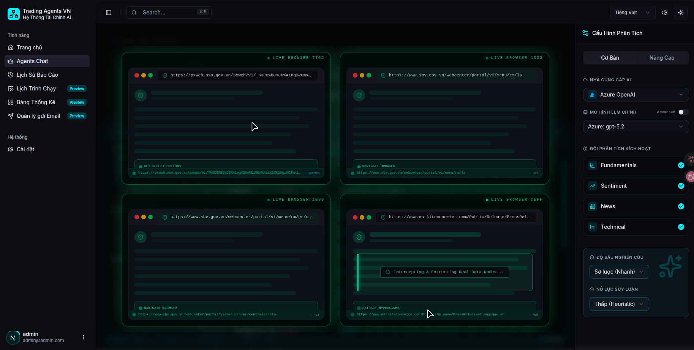
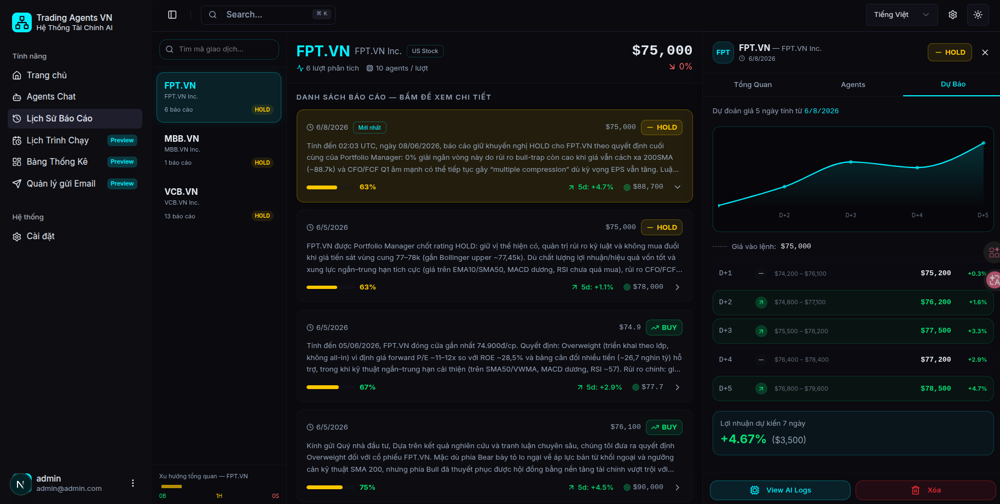
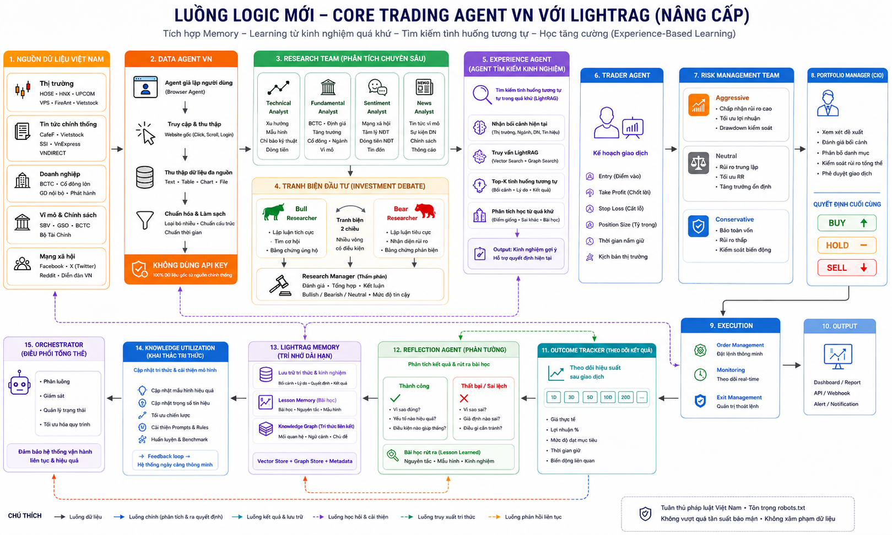

<div align="center">
  <h1>TradingAgents-Vn: Nền Tảng AI Phân Tích Chứng Khoán & Bot Giao Dịch Đa Tác nhân (Multi-Agent)</h1>
  <p><i>Phiên bản Nâng cấp Toàn diện & Công cụ Đầu tư Tối ưu cho Thị trường Tài chính Việt Nam</i></p>
</div>

<div align="center" style="line-height: 1; margin-top: 10px; margin-bottom: 20px;">
  <a href="https://github.com/TauricResearch/TradingAgents" target="_blank"></a>
  <a href="https://arxiv.org/abs/2412.20138" target="_blank"></a>
  <a href="#" target="_blank"></a>
</div>

> **TradingAgents-Vn** được kế thừa trực tiếp từ nền tảng [**TradingAgents**](https://github.com/TauricResearch/TradingAgents) (Tauric Research) nguyên bản và nâng cấp mở rộng đột phá. Ứng dụng sức mạnh của kiến trúc Đa Tác nhân AI (Multi-Agent System), hệ thống đóng vai trò như một **bot AI chứng khoán thông minh**, mô phỏng chính xác quy trình vận hành của một Quỹ Đầu Tư chuyên nghiệp (Hedge Fund) ngay trên trình duyệt của bạn. Bằng việc giải quyết triệt để bài toán thu thập **dữ liệu chứng khoán realtime** nội địa, nền tảng cung cấp **công cụ phân tích kỹ thuật** và ra quyết định đầu tư liền mạch, tự động và khách quan.

<br>

### Tại Sao Nên Chọn Công Cụ Phân Tích TradingAgents-Vn?

#### Kiến Trúc Vững Chắc & Hiệu Suất Đầu Tư Cao
- **Xử Lý Luồng Phức Tạp:** Sử dụng **LangGraph** điều phối mượt mà nhiều **AI Trading Bot** đồng thời.
- **Real-time (Thời Gian Thực):** Kiến trúc `asyncio` đẩy trực tiếp suy luận của AI lên UI không độ trễ.
- **Tối Ưu Tài Nguyên:** Phân loại thông minh giữa truy vấn nhanh (định giá cổ phiếu, biểu đồ chứng khoán) và phân tích chuyên sâu.

#### Chống "Ảo Giác" AI & Chuẩn Mực Đầu Tư Chứng Khoán
- **Cơ Chế Tranh Biện (Debate):** Mô hình đối kháng `Bull` vs `Bear` triệt tiêu ảo giác LLM và thiên kiến xác nhận trong đầu tư.
- **Đầu Ra Chính Xác:** Chuẩn hóa dữ liệu bằng Pydantic đảm bảo logic và định dạng báo cáo phân tích.
- **Chuẩn Quỹ Đầu Tư:** Phân tích độc lập $\rightarrow$ Tranh biện $\rightarrow$ Quản trị rủi ro chứng khoán $\rightarrow$ Duyệt $\rightarrow$ Thực thi lệnh.
- **Giao Dịch Thực Chiến:** Đưa ra rõ khuyến nghị giao dịch, Target Price, Stop Loss, tối ưu Risk/Reward và dự phóng thị trường 5 ngày.

#### Khác Biệt Cốt Lõi: Thu Thập Dữ Liệu Chứng Khoán "Sống" Nội Địa
Khác với bản gốc dùng API chung, phần mềm **TradingAgents-Vn** tích hợp Browser Agent (Playwright) giải quyết triệt để bài toán dữ liệu "đóng" tại thị trường Việt Nam:
- **Dữ Liệu Độc Quyền:** Tự động trích xuất vĩ mô, dòng tiền quỹ ETF, sở hữu khối ngoại, và tâm lý thị trường từ CafeF, FireAnt, sàn HOSE/HNX.
- **Độ Tin Cậy Tuyệt Đối:** Không dùng mock data. **Bot giao dịch AI** ra quyết định hoàn toàn dựa trên thông số giao dịch thực tế theo thời gian thực.
- **Công Cụ Phân Tích Nhanh:** Cung cấp bộ lọc cổ phiếu thông minh, định giá P/E, và nhận diện mẫu hình nến kỹ thuật tức thời.

---

### Kiến Trúc Đội Ngũ AI & Luồng Vận Hành (Architecture & Execution Flow)

Hệ thống hoạt động theo một quy trình khép kín gồm 5 giai đoạn chính, giả lập hoàn toàn cấu trúc của một Quỹ Đầu Tư chuyên nghiệp kết hợp với cơ chế Học hỏi liên tục (Memory & Learning).

<p align="center">
  
</p>
<p align="center"><i>Kiến trúc Orchestrator và luồng đi lệnh Đa Tác nhân (Multi-Agent) của TradingAgents-Vn.</i></p>

#### Giai đoạn 1: Điều Phối & Nhập Liệu (Orchestration & Data Ingestion)
- **Orchestrator Agent (Điều phối viên):** Đóng vai trò tổng chỉ huy. Phân tích ý định của người dùng từ UI/Chat để quyết định hướng xử lý.
- **Tra cứu nhanh:** Nếu người dùng cần xem biểu đồ, giá, hay thông tin vĩ mô, các **Quick Analysis Tools** sẽ trả kết quả ngay lập tức.
- **Phân tích chuyên sâu:** Khi có yêu cầu đánh giá mã cổ phiếu, hệ thống chuyển giao (Handoff) cho **Propagator** khởi tạo quy trình phân tích sâu (Graph State).
- **Data Agent VN:** Đội ngũ chuyên biệt (Browser Agent) tự động truy cập website gốc, thu thập, chuẩn hóa dữ liệu đa nguồn (Text, Table, Chart) mà không phụ thuộc vào API Key.

#### Giai đoạn 2: Phân Tích Đa Chiều & Tranh Biện (Analyst Swarm & Investment Debate)
- **Nhóm Phân Tích (Analyst Swarm):** Hoạt động song song với 4 Tác nhân chuyên môn:
  - *Technical Analyst:* Đánh giá xu hướng, mô hình, chỉ báo (MA, RSI, MACD), hỗ trợ/kháng cự.
  - *Fundamentals Analyst:* Báo cáo tài chính, định giá, tăng trưởng, cơ cấu cổ đông.
  - *Sentiment Analyst:* Phân tích tâm lý thị trường, dòng tiền, tin đồn trên mạng xã hội.
  - *News Analyst:* Tin tức vĩ mô, sự kiện doanh nghiệp, thông cáo chính thức.
- **Tranh Biện Đầu Tư (Investment Debate):** Cơ chế lõi giúp triệt tiêu ảo giác (Hallucination). **Bull Researcher** (Phe Bò) và **Bear Researcher** (Phe Gấu) thực hiện tranh biện qua nhiều vòng có điều kiện để tìm ra cơ hội và rủi ro ẩn. 
- **Research Manager (Thẩm phán):** Đánh giá các luận điểm, tổng hợp kết luận (Verdict) kèm mức độ tự tin.

#### Giai đoạn 3: Quản Trị Rủi Ro & Thực Thi (Risk Evaluation & Execution)
- **Trader Agent:** Xây dựng kịch bản giao dịch chi tiết: Điểm vào (Entry), Chốt lời (Take Profit), Cắt lỗ (Stop Loss) và Tỷ trọng (Position Size).
- **Risk Management Team:** Đánh giá rủi ro qua 3 lăng kính: Tấn công (Aggressive), Trung lập (Neutral), Phòng thủ (Conservative) để thử tải (Stress test) kịch bản.
- **Portfolio Manager (CIO):** Giám đốc danh mục kiểm soát rủi ro tổng thể và phê duyệt quyết định giao dịch cuối cùng: `BUY`, `HOLD` hoặc `SELL`.

#### Giai đoạn 4: Tự Động Học Hỏi (Memory & Learning Loop)
Hệ thống không tĩnh mà liên tục tiến hóa, đúc rút kinh nghiệm từ quá khứ:
- **Trading Memory Log:** Lưu trữ lịch sử quyết định và P&L thực tế.
- **Reflector Agent:** Đánh giá chất lượng, đối chiếu hiệu suất thực tế với Benchmark, tìm ra nguyên nhân thành công/thất bại.
- **Context Injection:** Bơm kinh nghiệm đã được đúc kết vào Orchestrator, giúp các Tác nhân điều chỉnh niềm tin và cải thiện độ chuẩn xác cho các lần ra quyết định sau.

#### Giai đoạn 5: Tổng Hợp & Báo Cáo (Synthesis & Reporting)
- **Chief Editor (System):** Biên soạn Executive Summary tổng hợp khuyến nghị, phân tích rủi ro và dự báo 5 ngày tới.
- Kết xuất chuẩn JSON, lưu vào bộ nhớ và hiển thị trực quan lên Dashboard, Reports cho người dùng theo dõi.

<p align="center">
  
</p>
<p align="center"><i>Sơ đồ chi tiết luồng vận hành lõi: Thu thập dữ liệu Việt Nam, Tranh biện, Quản trị Rủi ro & Học hỏi liên tục.</i></p>

---

### Giao Diện Trực Quan & Tương Tác

Nền tảng cung cấp một giao diện người dùng chuyên nghiệp, cho phép giám sát luồng công việc của các Tác nhân và tương tác dữ liệu theo thời gian thực.

<p align="center">
  
</p>
<p align="center"><i>Giao diện hội thoại thông minh tự động kết xuất biểu đồ kỹ thuật và dòng tiền.</i></p>

<p align="center">
  
</p>

<p align="center">
  
</p>
<p align="center"><i>Giám sát luồng thu thập dữ liệu (scraping) thị trường trực tiếp.</i></p>

<p align="center">
  
</p>
<p align="center"><i>Báo cáo đầu ra có cấu trúc chặt chẽ với khuyến nghị, mức độ tự tin và dự phóng 5 ngày.</i></p>
---

### Tính Năng Đặc Biệt: Đóng Vòng Lặp Học Hỏi với LightRAG & Reflection Agent (Preview Logic)

**Vấn đề hiện tại:** Hệ thống đang học hỏi bằng cách đọc trực tiếp các báo cáo và log lưu trong cơ sở dữ liệu. Cách làm này gặp hạn chế lớn do context của log quá dài và thiếu sự liên kết rõ ràng về mối quan hệ giữa các dữ kiện.

**Giải pháp Nâng cấp:** Để giải quyết triệt để, hệ thống đang phát triển tích hợp **LightRAG** và **Reflection Agent** nhằm tạo ra một cơ chế tự học (self-learning) thực thụ:

- **LightRAG (Bộ Não Tri Thức):** Thay vì đọc log thô, LightRAG đóng vai trò như bộ não chính, phân tích và biến đổi toàn bộ log thành các *node logic liên kết với nhau như mạng nơ-ron*. Nhờ đó, Agent có thể hiểu và tìm kiếm các mẫu tương đồng ứng với từng bài toán cụ thể. Quá trình này không chỉ giới hạn ở một mã cổ phiếu mà là một *cơ chế toàn cục* quét qua tất cả những gì hệ thống đã từng phân tích trong quá khứ.
- **Vòng Lặp Phát Triển Liên Tục:** 
  1. Khi phân tích, Agent truy vấn LightRAG để tìm các kết quả/logic gần nhất. 
  2. Dựa trên kết quả đó, hệ thống tham chiếu lại log chi tiết từ MongoDB và so sánh với *dữ liệu thực tế của tương lai* (những dự đoán đã diễn ra). 
  3. Từ sự đối chiếu này, AI rút ra các bài học kinh nghiệm sâu sắc.
  4. Kinh nghiệm đúc kết được sẽ lưu ngược lại vào "bộ não" LightRAG cho các lần sử dụng tương tự tiếp theo. Điều này tạo thành một vòng lặp phát triển liên tục, giúp mô hình ngày càng nhạy bén.

*(Logic này đã được thiết kế hoàn thiện và đang trong giai đoạn preview. Chức năng chi tiết sẽ được triển khai ở bản cập nhật tiếp theo).*

<p align="center">
  
</p>
<p align="center"><i>Sơ đồ logic: Vòng lặp học hỏi liên tục qua Knowledge Graph của LightRAG & Reflection Agent.</i></p>

---

### Hướng Dẫn Cài Đặt & Khởi Chạy

#### Yêu cầu hệ thống
- **Môi trường:** Linux/macOS hoặc WSL (Windows)
- **Node.js:** `>= 20.9.0` (Khuyến nghị dùng `nvm`)
- **Python:** `>= 3.10`
- **Docker:** Docker & Docker Compose (cho môi trường Production)

#### 1. Triển khai bằng Docker (Production)
Cách nhanh nhất và ổn định nhất để chạy ứng dụng.

```bash
# Xây dựng và khởi động toàn bộ hệ thống
docker compose up -d --build

# Kiểm tra trạng thái các containers
docker compose ps
```
> **Lưu ý:** UI sẽ chạy tại `http://localhost:3000` và Backend API tại `http://localhost:8000`. 
> Tài khoản Admin mặc định được thiết lập qua biến môi trường `DEFAULT_ADMIN_EMAIL` và `DEFAULT_ADMIN_PASSWORD` (Mặc định: `admin@tradingagents.com` / `admin123`).
> Bạn có thể thay đổi bằng cách tạo file `.env` từ `.env.example` trước khi build.

#### 2. Triển khai Local (Development)

##### Bước 2.1: Khởi chạy Backend
```bash
# Di chuyển vào thư mục dự án
cd TradingAgents-Vn

# (Tuỳ chọn) Tạo môi trường ảo
python3 -m venv .venv
source .venv/bin/activate

# Cài đặt framework cốt lõi
pip install -e .

# Cài đặt backend
pip install -e ./trading-be

# Cài đặt Playwright (bắt buộc để thu thập dữ liệu web)
playwright install chromium --with-deps

# Khởi chạy Backend
cd trading-be

# (Quan trọng) Copy file template và cấu hình env nếu cần đổi Admin mặc định
cp .env.example .env

alembic upgrade head           # Chạy database migrations
python scripts/seed_admin.py   # Tạo tài khoản admin mặc định dựa trên .env
fastapi dev main.py --host 0.0.0.0 --port 8000
```

##### Bước 2.2: Khởi chạy Frontend (UI)
Mở một terminal mới:
```bash
# Di chuyển vào thư mục UI
cd TradingAgents-Vn/trading-ui

# Cài đặt dependencies và chạy UI
npm install
npm run dev
```

---

### Triển Khai Lên Render (Free Tier)

Repo này sẵn sàng deploy full stack (Backend + UI) lên Render thông qua Blueprint — xem [DEPLOY_RENDER.md](./DEPLOY_RENDER.md). Dữ liệu OHLCV thị trường VN chạy theo chuỗi dự phòng **DNSE → vnstock/VCI → TCBS** với validation contract tại mỗi tầng (`tradingagents/dataflows/vn_ohlcv.py`).

---

<div align="left">
  <p><i><b>Tuyên Bố Miễn Trừ Trách Nhiệm:</b> TradingAgents-Vn được thiết kế nghiêm ngặt cho mục đích nghiên cứu, giáo dục và thử nghiệm thuật toán AI. Hệ thống không cung cấp lời khuyên tài chính hay khuyến nghị đầu tư chính thức. Người dùng tự chịu trách nhiệm cho các quyết định đầu tư thực tế.</i></p>
</div>
